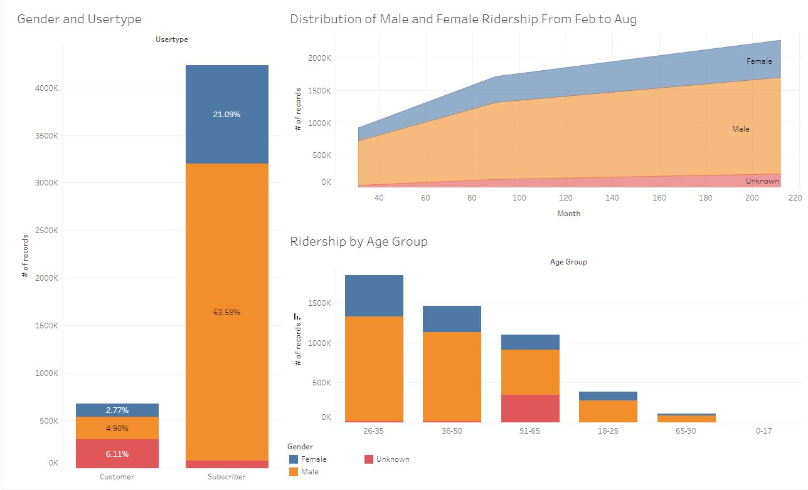
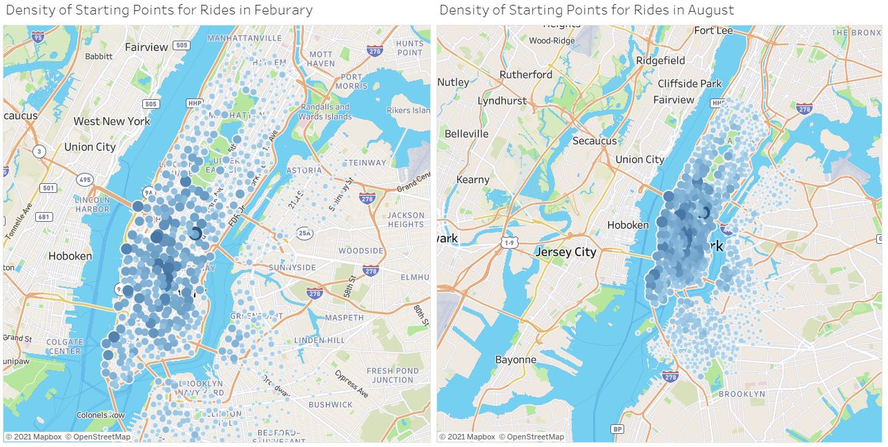

# Tableau

https://public.tableau.com/profile/strivedi#!/vizhome/sumitaproj/DemographicDeistribtion

Submitted Tableau Public link above. 
.tbwx file was too large to be added to git repo.

In the Tableau visualization, I have used citibike data from Feb - 2019, April-2019, August-2019, April- 2020.

In total, I have created five visualizations and four different maps. I have compiled these into three different dashboards, shown below:

This one analyses the phenomonen of gender across a number of different metadate attributes like usertype, number of records, and distribution by age group:

Next, to see the impact of seasonal weather on ridership I analysed the number of rides that were initiated at different stations across the city. The size of each dot resembles the number of rides that began at that station. One can easily see that Citi Bike usage is far more popular in August rather than Feburary. 

