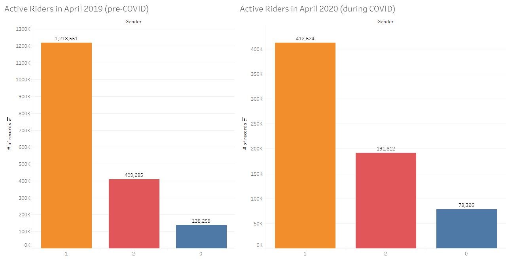

# Tableau

https://public.tableau.com/profile/strivedi#!/vizhome/sumitaproj/DemographicDeistribtion

Submitted Tableau Public link above. 
.tbwx file was too large to be added to git repo.

In the Tableau visualization, I have used citibike data from Feb - 2019, April-2019, August-2019, April- 2020.

In total, I have created seven visualizations and two different maps. I have compiled these into three different dashboards, shown below:

This one analyses the phenomonen of gender across a number of different metadate attributes like usertype, number of records, and distribution by age group:

Next, to see the impact of seasonal weather on ridership I analysed the number of rides that were initiated at different stations across the city. The size of each dot resembles the number of rides that began at that station. One can easily see that Citi Bike usage is far more popular in August rather than Feburary. 

A similar strategy can be used to analyze the impact of Covid-19 and government-enforced lockdowns on overall ridership. To do this, I analyzed the number of active riders by gender but used data from April 2019 and April 2020 (where lockdown was the most feverent). As can be seen, the proportions among gender remained relatively constant, but the number of riders in April 2020 is about a third of the number of riders in April 2019. 

